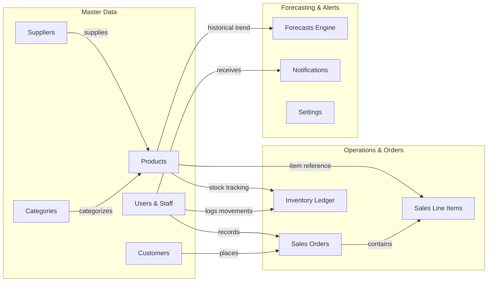

# ForecastIQ — Intelligent Sales Forecasting & Inventory Intelligence Platform

[](https://www.python.org/)
[](https://flask.palletsprojects.com/)
[](https://www.sqlite.org/)
[](https://getbootstrap.com/)
[](https://www.chartjs.org/)
[](LICENSE)
[](https://github.com/vivek-kumar-kandu/ForecastIQ-Intelligent-Sales-Inventory-Intelligence/pulls)

> **ForecastIQ** is an end-to-end, AI-powered sales forecasting and inventory intelligence platform built with Python (Flask) and SQLite. It delivers predictive demand forecasting, automated reorder recommendations, real-time stock-out anomaly prevention, multi-item point-of-sale (POS) processing, and role-based access control.

---

## 📌 Table of Contents

- [Overview](#-overview)
- [Key Features](#-key-features)
- [Forecasting Engine & Mathematics](#-forecasting-engine--mathematics)
- [Repository Structure & Milestones](#-repository-structure--milestones)
- [Quickstart & Local Installation](#-quickstart--local-installation)
- [Demo Credentials](#-demo-credentials)
- [Database Architecture](#-database-architecture)
- [Application Blueprint Routes](#-application-blueprint-routes)
- [Security & Production Readiness](#-security--production-readiness)
- [Contributing & License](#-contributing--license)

---

## 🚀 Overview

ForecastIQ transforms raw transaction logs into actionable inventory insights. Designed with a clean **Application Factory** pattern and modular Flask blueprints, the system eliminates bulky external ML dependencies by implementing core time-series algorithms in optimized, native Python.

Whether tracking fast-moving items, calculating optimal safety stock levels, or preventing costly over-stock and stock-out scenarios, ForecastIQ equips retail and supply chain teams with the exact tools needed to optimize working capital.

---

## ✨ Key Features

### 📊 1. Executive Intelligence Dashboard
- **Real-Time KPIs**: Total revenue, daily sales velocity, monthly turnover, total active SKUs, and inventory valuation calculated at cost basis.
- **Interactive Visualizations**: 6-month historical revenue trend lines, product category share breakdowns, and real-time inventory health status gauges powered by Chart.js.
- **Actionable Alerts**: Highlights out-of-stock items, critical thresholds, and low-stock warnings at a glance.

### 📈 2. Triple-Algorithm Sales Forecasting Engine
- **Moving Average (3-Period)**: Smooths short-term demand variations to reveal fundamental baseline trajectory.
- **Exponential Smoothing ($\alpha = 0.3$)**: Employs geometric weight decay, giving higher relevance to recent sales surges.
- **Linear Regression (OLS)**: Fits least-squares trend lines to project forward-looking growth or decline trends.
- **Ensemble Model**: Blends all three methodologies to deliver a consensus projection with reduced model variance.
- **Accuracy Confidence Scoring**: Computes dynamic confidence scores using Mean Absolute Percentage Error (MAPE):
  $$\text{Confidence Score} = \max(0, 100 - \text{MAPE})$$
- **SKU Demand Run-Out Projections**: Calculates expected monthly unit demand, stock coverage ratios, and restock urgency flags.

### 📦 3. Inventory Management & Smart Restocking
- **Color-Coded Status Tracking**: Dynamic badges for `In Stock`, `Low Stock`, `Critical` ($\le 5$ units), and `Out of Stock` ($0$ units).
- **Movement Audit Ledger**: Complete historical tracking of stock adjustments (`in`, `out`, and `adjustment`) with user attribution and timestamping.
- **Intelligent Restocking Workbench**: Suggests reorder quantities based on recent 30-day sales run rates:
  $$\text{Suggested Reorder} = \max(\text{reorder\_quantity}, \text{round}(\text{avg\_monthly\_sales} \times 2))$$
- **Capital Requirement Estimates**: Automatically computes the purchase cost required to restock each low-inventory SKU.

### 🛒 4. Point of Sale (POS) & Sales Execution
- **Multi-Line Item Checkout**: Dynamic client-side order builder supporting multi-product cart additions with instant subtotal and tax calculation.
- **Automatic Stock Deduction**: Automatically deducts quantities from the warehouse and records movement audit entries upon checkout completion.
- **Customer Lifetime Value Tracking**: Updates customer purchase totals in real-time.
- **Flexible Payment Methods**: Full support for Cash, Card, UPI, and Online payments.

### 👥 5. Master Data Management
- **Products**: Manage product SKU code, name, category, brand, supplier, cost price, selling price, safety stock levels, and reorder units.
- **Customers**: Directory of customer contact details, addresses, and cumulative order metrics.
- **Suppliers**: Vendor database with active catalog counts and direct supplier contact info.
- **Categories**: Dynamic category groupings with revenue contribution tracking.

### 📑 6. Reports & Instant CSV Data Export
- Comprehensive date-filtered sales summaries, order totals, and discount breakdowns.
- Inventory valuation reports with stock levels and total asset value.
- High-speed streaming CSV data exports for:
  - `sales_YYYYMMDD.csv`
  - `inventory_YYYYMMDD.csv`
  - `products_YYYYMMDD.csv`

### 🛡️ 7. Security & Role-Based Access Control (RBAC)
- Three permission levels:
  - **Admin**: Full access including user provisioning, password resets, and system configuration.
  - **Manager**: Operations, inventory, restock orders, sales, forecasting, and analytics.
  - **Staff**: POS checkout, product lookup, and customer directory access.
- Secure password hashing via Werkzeug (`scrypt` / `pbkdf2`).
- Custom CSRF protection on all state-altering POST requests.
- Brute-force throttling delays on failed authentication attempts.

---

## 🧮 Forecasting Engine & Mathematics

ForecastIQ implements time-series models from scratch in `utils.py` without external ML dependencies:

| Algorithm | Formulation | Description |
| :--- | :--- | :--- |
| **Simple Moving Average** | $\hat{y}_{t+1} = \frac{1}{k} \sum_{i=0}^{k-1} y_{t-i}$ | Averages the last $k=3$ periods to eliminate noise. |
| **Exponential Smoothing** | $S_t = \alpha \cdot y_t + (1 - \alpha) \cdot S_{t-1}$ | Applies decay constant $\alpha = 0.3$ prioritizing recent demand. |
| **Linear Regression** | $\hat{y} = mx + b \quad \text{where } m = \frac{n\sum xy - \sum x \sum y}{n\sum x^2 - (\sum x)^2}$ | Ordinary Least Squares trend line projected to period $n+1$. |
| **Ensemble Model** | $\hat{y}_{\text{ensemble}} = \frac{\hat{y}_{\text{MA}} + \hat{y}_{\text{ES}} + \hat{y}_{\text{LR}}}{3}$ | Combines predictions into a resilient consensus forecast. |
| **Confidence Metric** | $\text{Confidence} = 100 - \left( \frac{100}{n} \sum \left\| \frac{y_i - \hat{y}_i}{y_i} \right\| \right)$ | Backtests predictions against actuals using MAPE. |

---

## 📂 Repository Structure & Milestones

The repository offers both the **complete integrated production application** and an **incremental milestone curriculum**:

```text
ForecastIQ/
├── ForecastIQ-Complete/       # Complete production application (all modules integrated)
├── milestone-4/               # Milestone 4: Complete app with Forecasting & Administration
├── milestone-3/               # Milestone 3: Sales, Notifications, and CSV Reports
├── milestone-2/               # Milestone 2: Products, Inventory, Customers & Suppliers
├── milestone-1/               # Milestone 1: Authentication & Dashboard Foundation
├── ForecastIQ-GitHub/         # Historical milestone archive
├── README.md                  # Project documentation & guides
└── .gitignore                 # Repository ignore rules
```

### Module Breakdown (Inside `milestone-4/` or `ForecastIQ-Complete/`)

```text
├── app.py                     # Flask application factory and context processors
├── config.py                  # Environment and database configuration
├── db.py                      # SQLite connection pooling & query abstractions
├── init_db.py                 # Schema migration & rolling 6-month seed generator
├── requirements.txt           # Minimal dependencies (Flask 3.0.3, Werkzeug 3.0.3)
├── utils.py                   # Math algorithms, auth decorators, and formatters
├── database/
│   ├── schema.sql             # Full DDL schema with relational constraints
│   └── forecastinq.db         # SQLite runtime database (generated by init_db.py)
├── blueprints/
│   ├── auth.py                # Login, registration, session termination
│   ├── dashboard.py           # Metrics aggregation and Chart.js feeds
│   ├── products.py            # Product catalog CRUD & threshold configurations
│   ├── inventory.py           # Stock movements and automated restock logic
│   ├── sales.py               # POS checkout and inventory deduction
│   ├── forecasting.py         # Time-series forecasting and confidence scoring
│   ├── reports.py             # Analytics reporting and CSV export streaming
│   ├── customers.py           # Customer profiles and purchase volumes
│   ├── suppliers.py           # Supplier registry and catalog links
│   ├── notifications.py       # Notification dispatch and read-state management
│   ├── settings.py            # Global company and store settings (Admin only)
│   └── users.py               # User account administration (Admin only)
├── templates/                 # Modular Jinja2 HTML templates
└── static/
    ├── css/app.css            # Responsive custom styles and theme variables
    └── js/app.js              # Sidebar toggle, dark mode, Chart.js renderers
```

---

## 💻 Quickstart & Local Installation

### Prerequisites
- **Python 3.9+**
- **pip**

### 1. Clone the Repository
```bash
git clone https://github.com/vivek-kumar-kandu/ForecastIQ-Intelligent-Sales-Inventory-Intelligence.git
cd ForecastIQ-Intelligent-Sales-Inventory-Intelligence
```

### 2. Navigate to the Complete App (or Desired Milestone)
```bash
cd milestone-4
# Alternatively: cd ForecastIQ-Complete
```

### 3. Create & Activate a Virtual Environment

**Windows (PowerShell):**
```powershell
python -m venv .venv
.\.venv\Scripts\Activate.ps1
```

**macOS / Linux:**
```bash
python3 -m venv .venv
source .venv/bin/activate
```

### 4. Install Dependencies
```bash
pip install -r requirements.txt
```

### 5. Initialize & Seed the Database
```bash
python init_db.py
```
> **Note:** `init_db.py` creates the SQLite database and seeds 6 months of historical transactions relative to the current date so that all dashboard charts and forecasting models display immediate, meaningful data.

### 6. Launch the Server
```bash
python app.py
```

Open your browser and navigate to:
```
http://localhost:5000
```

---

## 🔑 Demo Credentials

The pre-seeded database includes three ready-to-use accounts with different access tiers:

| Username | Role | Password | Access Privileges |
| :--- | :--- | :--- | :--- |
| **`admin`** | Administrator | `Admin@123` | Full access: Settings, User Management, Forecasting, Inventory, Sales, Reports |
| **`manager`** | Store Manager | `Admin@123` | Operations access: Forecasting, Restocking, Products, Sales, Reports |
| **`staff`** | Sales Staff | `Admin@123` | Frontline access: POS Checkout, Product Catalog, Customer Directory |

*(New accounts can also be self-registered directly from the `/auth/register` page.)*

---

## 🗄️ Database Architecture

The SQLite relational schema (`database/schema.sql`) utilizes standard foreign keys and constraints:



### Core Entities & Relations

| Table | Primary Role | Key Foreign Relationships |
| :--- | :--- | :--- |
| **`users`** | Authentication, roles (`admin`, `manager`, `staff`), and access status | Referenced by `sales`, `inventory`, `notifications` |
| **`products`** | SKU, pricing margins, current stock, and safety reorder levels | `category_id` $\to$ `categories`, `supplier_id` $\to$ `suppliers` |
| **`categories`**| Product classification taxonomy | Parent of `products` |
| **`suppliers`** | Vendor profiles, contact records, and active catalogue counts | Associated with `products` |
| **`customers`** | Customer directory and real-time lifetime purchase volume | Associated with `sales` |
| **`sales`** | Transaction headers, discounts, taxes, totals, and payment modes | `customer_id` $\to$ `customers`, `user_id` $\to$ `users` |
| **`sales_items`**| Individual line items within each transaction | `sale_id` $\to$ `sales`, `product_id` $\to$ `products` |
| **`inventory`** | Audit ledger for stock movements (`in`, `out`, `adjustment`) | `product_id` $\to$ `products`, `moved_by` $\to$ `users` |
| **`forecasts`** | Algorithmic prediction outputs, target dates, and confidence scores | `product_id` $\to$ `products`, `generated_by` $\to$ `users` |
| **`notifications`**| In-app alert queue for low stock, targets, and system notices | `user_id` $\to$ `users` |
| **`settings`** | Store configuration, base currency (`₹`), and tax thresholds | Global key-value store |

---

## 🌐 Application Blueprint Routes

| Blueprint | Route Prefix | Primary Endpoints | Access Level |
| :--- | :--- | :--- | :--- |
| **Auth** | `/auth` | `/login`, `/register`, `/logout` | Public |
| **Dashboard** | `/dashboard` | `/` (KPIs, Charts, Recent Activity) | Logged-in |
| **Products** | `/products` | `/` (CRUD, Search, Filter by Category) | Logged-in |
| **Inventory** | `/inventory` | `/` (Stock Ledger, Manual Adjustments), `/restocking` | Logged-in |
| **Sales** | `/sales` | `/` (POS Multi-Item Checkout, Transaction History) | Logged-in |
| **Forecasting**| `/forecasting` | `/` (Model Outputs, Ensemble Predictions, SKU Analysis) | Logged-in |
| **Reports** | `/reports` | `/` (Sales & Inventory Summaries), `/export` (CSV) | Logged-in |
| **Customers** | `/customers` | `/` (Customer List, Add, Edit, Delete) | Logged-in |
| **Suppliers** | `/suppliers` | `/` (Supplier Directory, Product Associations) | Logged-in |
| **Notifications**| `/notifications`| `/` (Alerts Feed, Mark All Read) | Logged-in |
| **Settings** | `/settings` | `/` (Company Info, Tax Rate, Low Stock Thresholds) | **Admin Only** |
| **Users** | `/users` | `/` (User Provisioning, Role Assignment, Deactivation)| **Admin Only** |

---

## 🔒 Security & Production Readiness

- **Secret Key**: Set `SECRET_KEY` via environment variable in production environments.
- **Database Backups**: As SQLite is a serverless single-file database (`forecastinq.db`), backup simply involves copying the database file during quiet periods or utilizing the SQLite backup API.
- **CSRF Protection**: All POST endpoints validate session-bound CSRF tokens to block cross-site request forgery attacks.
- **SQL Injection Prevention**: All queries in `db.py` use parameterized queries (`?` placeholders).

---

## 🤝 Contributing

Contributions, feature requests, and improvements are welcome!

1. Fork the Project
2. Create your Feature Branch (`git checkout -b feature/AmazingFeature`)
3. Commit your Changes (`git commit -m 'Add some AmazingFeature'`)
4. Push to the Branch (`git push origin feature/AmazingFeature`)
5. Open a Pull Request

---

## 📄 License

This project is open-source software licensed under the [MIT License](LICENSE).

---

<p align="center">
  <b>Developed & Maintained by <a href="https://github.com/vivek-kumar-kandu">Vivek Kumar Kandu</a></b>
</p>
