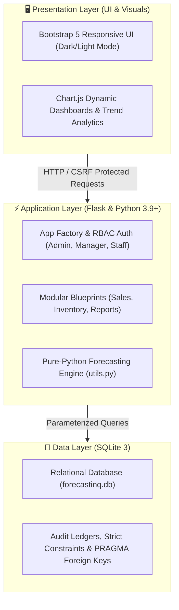
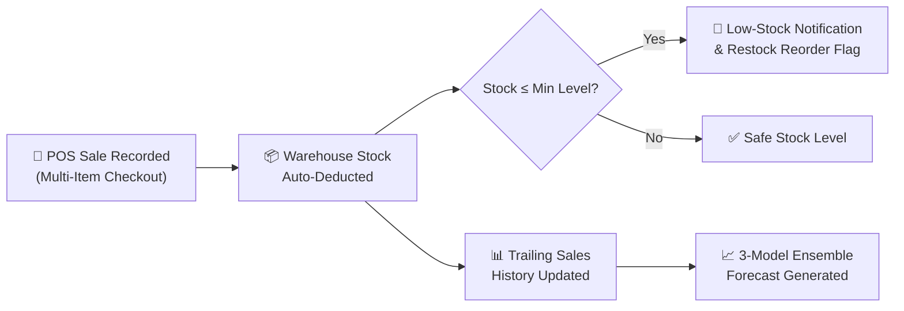

# ForecastIQ — Intelligent Sales Forecasting & Inventory Intelligence Platform

[](https://www.python.org/)
[](https://flask.palletsprojects.com/)
[](https://www.sqlite.org/)
[](https://getbootstrap.com/)
[](https://www.chartjs.org/)
[](LICENSE)

> **ForecastIQ** is a full-stack sales forecasting and inventory intelligence platform built with Python (Flask) and SQLite. It combines automated warehouse inventory tracking, multi-item POS sales execution, and pure-Python time-series forecasting (no heavy ML libraries required).

---

## 🏗️ System Architecture

ForecastIQ follows a clean 3-tier decoupled architecture designed for high maintainability and zero external ML bloat:



---

## 🔄 Core Business Workflow

The diagram below shows how an everyday store transaction flows through stock deduction, automated alerts, and forward-looking predictive modeling:



---

## ✨ Key Feature Highlights

- **📊 Executive Dashboard**: Real-time sales turnover, daily revenue, active SKU counts, category distribution donuts, and 6-month sales trend lines.
- **🛒 POS & Multi-Item Sales**: Fast multi-product checkout builder with auto stock deduction, customer purchase aggregation, and payment method tracking (`cash`, `card`, `online`, `upi`).
- **📦 Inventory & Smart Restocking**: Live stock tracking (`In Stock`, `Low Stock`, `Critical`, `Out of Stock`), complete movement audit trails (`in`, `out`, `adjustment`), and automatic 30-day run-rate reorder suggestions.
- **👥 Master Data Management**: Comprehensive CRUD management for Products, Categories, Suppliers, and Customers.
- **📑 Reports & One-Click CSV Export**: Date-filtered sales and inventory valuation summaries with streaming CSV exports.
- **🛡️ Role-Based Access Control (RBAC)**: Fine-grained access tiers for **Admin**, **Manager**, and **Staff** with password hashing and CSRF tokens.

---

## 🧮 Forecasting Engine & Mathematics

ForecastIQ builds predictive models directly from historical transaction records in `utils.py` without external ML dependencies:

| Model | Method | Mathematical Formulation | Parameters & Tuning | Best Suited For |
| :--- | :--- | :--- | :--- | :--- |
| **Simple Moving Average** | Time-Series | $\hat{y}_{t+1} = \frac{y_t + y_{t-1} + y_{t-2}}{3}$ | Window $k = 3$ | Stable demand items; filters short-term noise |
| **Exponential Smoothing** | Time-Series | $\hat{y}_{t+1} = \alpha y_t + (1 - \alpha) S_{t-1}$ | Alpha $\alpha = 0.3$ | Fast-moving SKUs with seasonal or recent shifts |
| **Linear Regression** | Econometric | $\hat{y} = mx + b \quad \left(m = \frac{n\sum xy - \sum x \sum y}{n\sum x^2 - (\sum x)^2}\right)$ | Slope $m$, Intercept $b$ | Products with clear upward or downward growth trends |
| **Ensemble Model** | Consensus | $\hat{y}_{\text{final}} = \frac{\text{MA} + \text{ES} + \text{LR}}{3}$ | Equal weights ($1/3$) | Store-wide projections with minimized variance |
| **Confidence Metric** | Validation | $\text{Score} = \max(0, 100 - \text{MAPE})$ | $\text{MAPE} = \frac{100}{n} \sum \frac{\text{abs}(y - \hat{y})}{y}$ | Trailing 6-month backtesting against actual closed sales |

---

## 🚀 Quickstart & Setup Guide

### 1. Clone & Enter Project
```bash
git clone https://github.com/vivek-kumar-kandu/ForecastIQ-Intelligent-Sales-Inventory-Intelligence.git
cd ForecastIQ-Intelligent-Sales-Inventory-Intelligence/milestone-4
# (or cd ForecastIQ-Complete)
```

### 2. Set Up Virtual Environment

**Windows (PowerShell):**
```powershell
python -m venv .venv
.\.venv\Scripts\Activate.ps1
```

**macOS / Linux:**
```bash
python3 -m venv .venv
source .venv/bin/activate
```

### 3. Install Dependencies & Seed Database
```bash
pip install -r requirements.txt
python init_db.py
```
> `init_db.py` creates the SQLite database and seeds 6 months of realistic historical sales so that dashboard charts and forecasts light up immediately.

### 4. Run the Application
```bash
python app.py
```
Open **[http://localhost:5000](http://localhost:5000)** in your browser.

---

## 🔑 Demo Login Accounts

All accounts share the default demo password:

| Username | Role | Password | Access Scope |
| :--- | :--- | :--- | :--- |
| **`admin`** | Administrator | `Admin@123` | Full access: Settings, User Management, Reports, Inventory, POS |
| **`manager`** | Store Manager | `Admin@123` | Operations access: Forecasting, Restocking, Products, Sales |
| **`staff`** | Sales Staff | `Admin@123` | Frontline access: POS Checkout, Product Catalog, Customer Lookup |

---

## 📂 Repository Structure & Milestones

The repository is organized into progressive milestones alongside the complete application:

| Folder | Stage | Description |
| :--- | :--- | :--- |
| **[`ForecastIQ-Complete/`](ForecastIQ-Complete/)** | **Production** | Full standalone application with all integrated modules |
| **[`milestone-4/`](milestone-4/)** | **Complete** | Full project with Sales Forecasting, User Management & Admin Settings |
| **[`milestone-3/`](milestone-3/)** | Milestone 3 | Sales transactions, Inventory deduction, Notifications & CSV Reports |
| **[`milestone-2/`](milestone-2/)** | Milestone 2 | Master data: Products, Inventory, Customers & Suppliers |
| **[`milestone-1/`](milestone-1/)** | Milestone 1 | Foundation: App factory, SQLite setup, Auth & Dashboard |

---

## 🗄️ Database Schema Summary

The relational database (`database/forecastinq.db`) contains 12 normalized tables with foreign keys and cascade policies:

| Table | Domain | Foreign Keys & Cascades | Key Purpose |
| :--- | :--- | :--- | :--- |
| **`users`** | Identity | None | Auth, roles (`admin`, `manager`, `staff`), password hashes |
| **`products`** | Catalog | `category_id` *(SET NULL)*, `supplier_id` *(SET NULL)* | SKUs, margins, stock levels, safety thresholds |
| **`categories`**| Catalog | None | Product category taxonomy |
| **`suppliers`** | Catalog | None | Vendor registry and contact directory |
| **`customers`** | Sales | None | Customer details and lifetime spend tracking |
| **`sales`** | Sales | `customer_id` *(SET NULL)*, `user_id` *(SET NULL)* | Transactions, totals, taxes, payment modes |
| **`sales_items`**| Sales | `sale_id` *(CASCADE)*, `product_id` *(CASCADE)* | Order line items with quantity and unit prices |
| **`inventory`** | Inventory | `product_id` *(CASCADE)*, `moved_by` *(SET NULL)* | Stock movement audit trail (`in`, `out`, `adjustment`) |
| **`forecasts`** | Intelligence| `product_id` *(SET NULL)*, `generated_by` *(SET NULL)* | Model predictions, horizons, and confidence scores |
| **`notifications`**| Alerts | `user_id` *(CASCADE)* | In-app alerts for low stock and system milestones |
| **`reports`** | Analytics | `generated_by` *(SET NULL)* | Registry of generated reports and export filters |
| **`settings`** | System | None | Store configuration, currency (`₹`), and tax rates |

---

## 📄 License & Credits

This project is open-source and released under the [MIT License](LICENSE).

<p align="center">
  <b>Developed & Maintained by <a href="https://github.com/vivek-kumar-kandu">Vivek Kumar Kandu</a></b>
</p>
